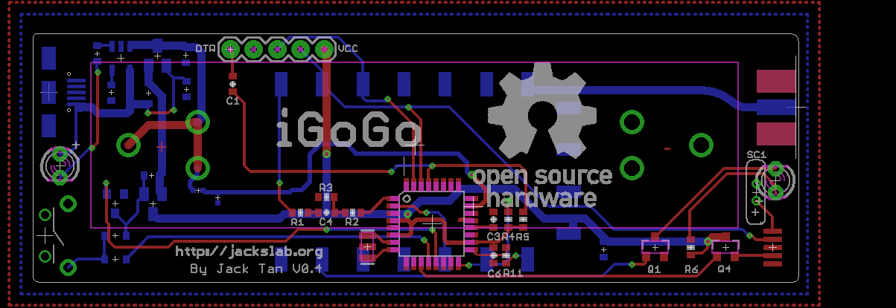

iGoGo - Pet APRS Tracker
=======================================

[*iGoGo Board*](http://jackslab.org/)

Features
-------------------
* ATMEGA328p MCU, Arduino compatible
* 1W VHF radio module
* 1200 bauds AFSK using 8-bit PWM
* Sends out standard APRS position messages
* mini GPS module
* 18650 power supply
* Open Source hardware and firmware 

Pin map
-------------------
iGoGo board

* D3 is the audio out pin
* D4 is the PTT pin
* D12 is the PD pin of radio module
* D13 is the PWR_CTRL pin of the radio module

* D8 is the power on input pin
* D9 is the power on output pin

Repository Contents
-------------------
* hardware/ - All Eagle design files (.brd, .sch) and Gerber files of iGoGo Board 
* firmware/ - Firmware source files of the iGoGo

Product Versions
----------------
* [IGOGO-001](http://www.jackslab.org/) - Bare pcb.
* [IGOGO-002](http://www.jackslab.org/) - Geek Kit. Bare pcb plus chips, stackable headers, indicator LEDs, push buttons and resistors ...
* [IGOGO-003](http://www.jackslab.org/) - Complete iGoGo board.

License Information
-------------------
The hardware is released under [Creative Commons ShareAlike 4.0 International](https://creativecommons.org/licenses/by-sa/4.0/).

Distributed as-is; no warranty is given.
