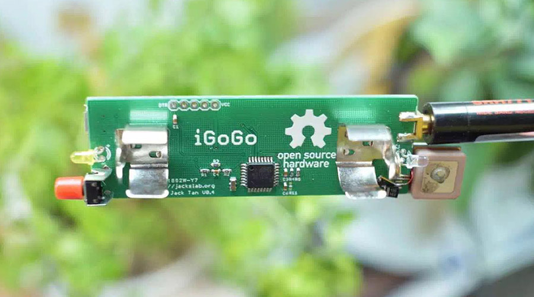
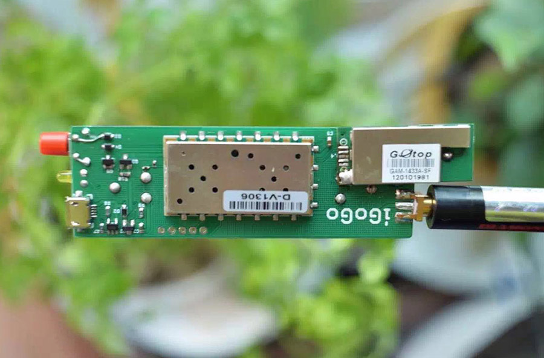
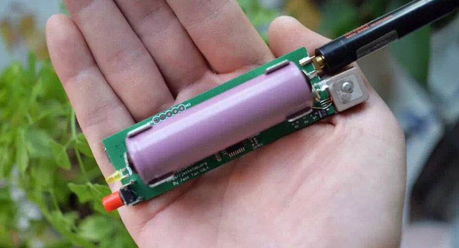

iDuoDuo - Pet APRS Tracker
=======================================

More photo of My DuoDuo :) [My DuoDuo Life](http://comcat.lofter.com/tag/%E5%A4%9A%E5%A4%9A)

[*iDuoDuo Board*](http://jackslab.org/)

Features
-------------------
* ATMEGA328p MCU, Arduino compatible
* 1W VHF radio module ([SR_FRS_1WV](https://item.taobao.com/item.htm?id=21278567784))
* 1200 bauds AFSK using 8-bit PWM
* Sends out standard APRS position messages
* mini GPS module
* 18650 power supply
* Open Source hardware and firmware 

Pin map
-------------------
iDuoDuo board

* D3 is the audio out pin
* D4 is the PTT pin
* D12 is the PD pin of radio module
* D13 is the PWR_CTRL pin of the radio module

* D8 is the power on input pin
* D9 is the power on output pin

Repository Contents
-------------------
* hardware/ - All Eagle design files (.brd, .sch) and Gerber files of iDuoDuo Board 
* firmware/ - Firmware source files of the iDuoDuo

Product Versions
----------------
* [IDuoDuo-V0.4](hardware/V0.4/) - Stupid bug of the S1 key package.
* [IDuoDuo-V0.6](hardware/V0.6/) - work OK.

License Information
-------------------
The hardware is released under [Creative Commons ShareAlike 4.0 International](https://creativecommons.org/licenses/by-sa/4.0/).

Distributed as-is; no warranty is given.
